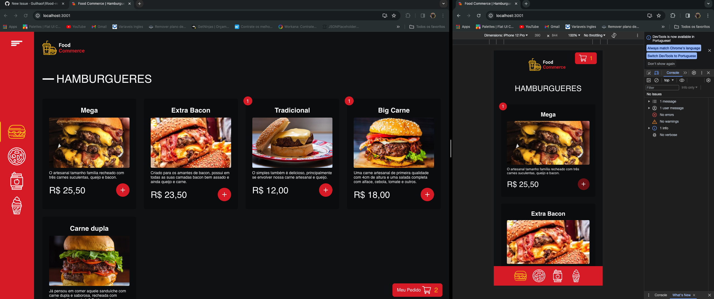
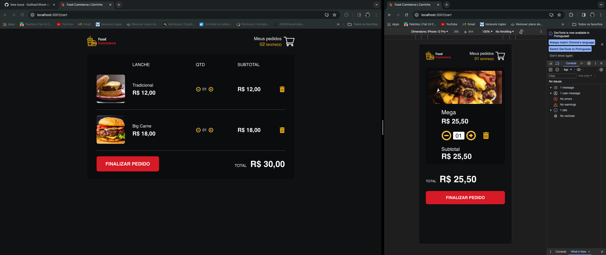
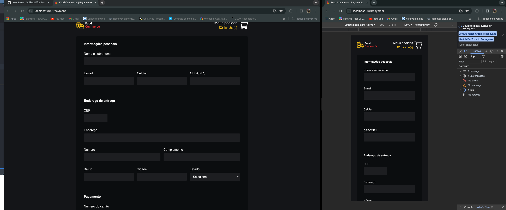
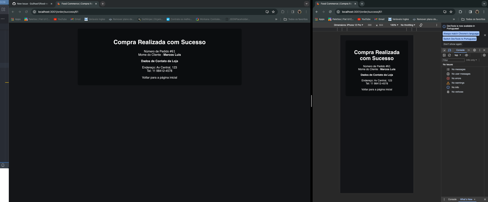

<div align="center" id="top"> 
  
  &#xa0;
  <!-- <a href="https://nativehelp.netlify.app">Demo</a> -->
</div>

<h1 align="center">Food Commerce</h1>

<p align="center">
  
  
  
  
</p>

<p align="center">
  <a href="#dart-sobre">Sobre o Projeto</a> &#xa0; | &#xa0; 
  <a href="#sparkles-funcionalidades">Funcionalidades</a> &#xa0; | &#xa0;
  <a href="#rocket-tecnologias">Tecnologias</a> &#xa0; | &#xa0;
  <a href="#white_check_mark-requisitos">Requisitos</a> &#xa0; | &#xa0;
  <a href="#checkered_flag-iniciando-o-projeto">Iniciando o Projeto</a>
</p>

<br>


## :dart: Sobre ##

Food Commerce é um aplicativo de pedidos de comida desenvolvido em React, projetado para oferecer uma experiência simples e intuitiva ao usuário. Com uma interface amigável e atrativa, o app permite navegar por uma variedade de tipos de comida, visualizar o carrinho e os itens do pedido, acompanhar o status da entrega e até entrar em contato com a loja.

## :sparkles: Funcionalidades ##

:heavy_check_mark: Adicionar lanches ao carrinho\
:heavy_check_mark: Visualizar itens no carrinho\
:heavy_check_mark: Aplicação totalmente responsiva\
:heavy_check_mark: Gerenciamento completo do carrinho: exclui, adiciona, aumenta a quantidade de cada item e calcula o valor total automaticamente\
:heavy_check_mark: Geração de ordem de pagamento usando a API da Asaas (ambiente de testes)

<h2>🖥️📱 Tela de Apresentação — Mobile e Desktop</h2>
<p align="center"> 
 
</p>

<h2>🖥️📱 Carrinho — Mobile e Desktop</h2>
<p align="center"> 
 
</p>

<h2>🖥️📱 Formulário de Entrega e Pagamento — Mobile e Desktop</h2>
<p align="center"> 
 
</p>

<h2>🖥️📱 Pedido Confirmado — Mobile e Desktop</h2>
<p align="center"> 
 
</p>

## :rocket: Tecnologias ##

Tecnologias e ferramentas usadas neste projeto:

- [Node.js](https://nodejs.org/en/)
- [React](https://pt-br.reactjs.org/)
- [TypeScript](https://www.typescriptlang.org/)
- [JavaScript](https://developer.mozilla.org/pt-BR/docs/Web/JavaScript)
- [API de Pagamento da Asaas](https://www.asaas.com/)
- [Yup — Validador de Formulários](https://github.com/jquense/yup)
- [Styled-components](https://styled-components.com/)
- [React Router](https://reactrouter.com/en/main)

## :white_check_mark: Requisitos ##

Para iniciar, você deve ter o [Git](https://git-scm.com) e o [Node](https://nodejs.org/en/) instalados na sua máquina.

## :checkered_flag: Iniciando o Projeto ##

```bash
# Clone este repositório
$ git clone https://github.com/marcusguarani/ifood-react.git

# Acesse a pasta do projeto
$ cd ifood-react

# Instale as dependências
$ npm install

# Rode o projeto
$ npm run start
```

## ⚒️ Variáveis de Ambiente ##

Para rodar esse projeto, você vai precisar adicionar as seguintes variáveis de ambiente no seu `.env`:

`REACT_APP_API_BASE_URL`\
`PORT`

&#xa0;

<a href="#top">Voltar ao Topo</a>
